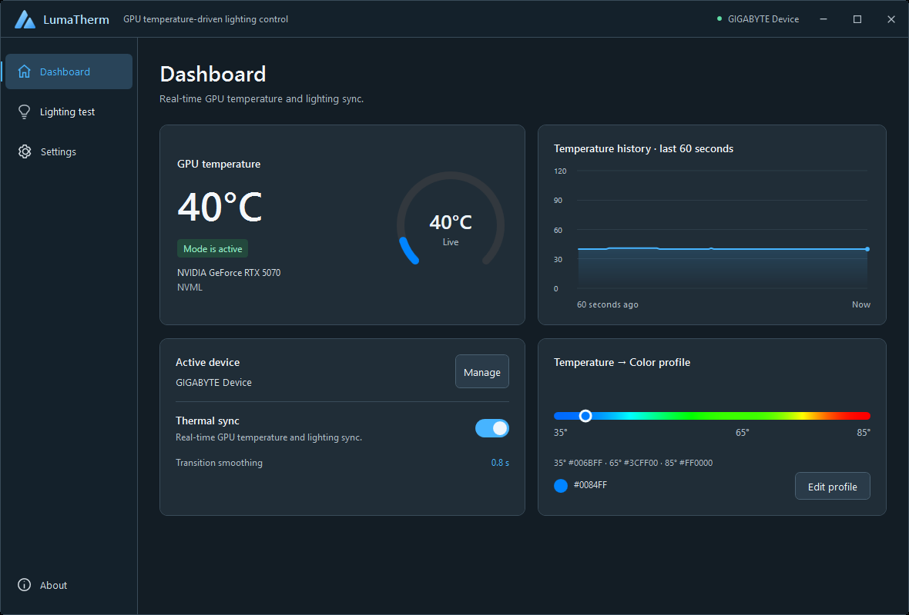
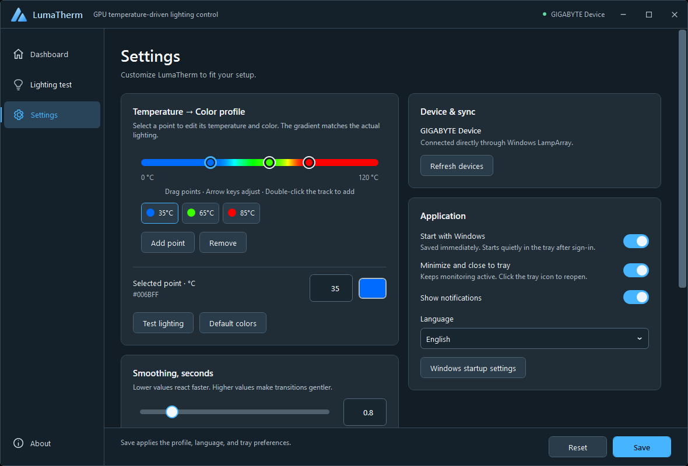
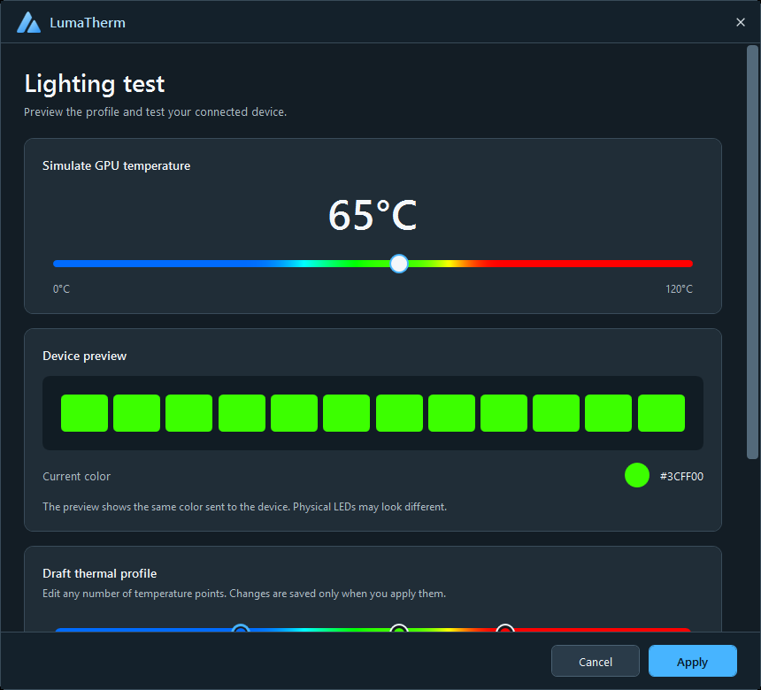
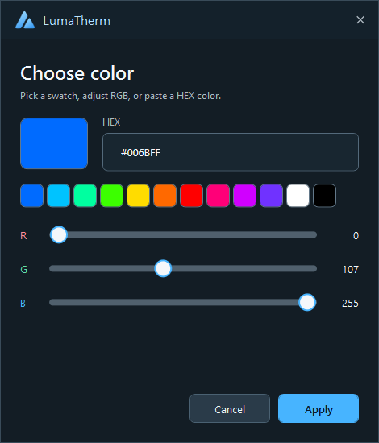
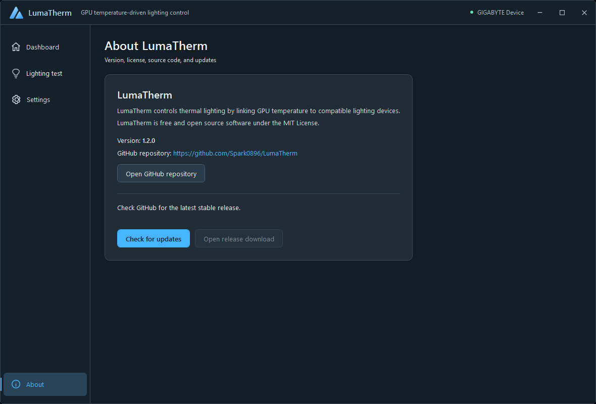

# LumaTherm

**GPU temperature → RGB lighting.** A lightweight Windows 11 app for monitoring your GPU and synchronizing compatible Dynamic Lighting devices.

English · [Русский](README.ru.md) · [Downloads](https://github.com/Spark0896/LumaTherm/releases) · [Installation](docs/installation.md)



## Make temperature visible

Watch your GPU temperature, follow its last 60 seconds, and let your lighting show how warm it is. LumaTherm reads NVIDIA NVML first, with MSI Afterburner shared memory as an optional read-only fallback. Lighting is controlled through Windows LampArray.

| Default profile | Temperature | Color |
| --- | --- | --- |
| Cool | 35°C | Blue `#006BFF` |
| Warm | 65°C | Green `#3CFF00` |
| Hot | 85°C | Red `#FF0000` |

Add, drag, or remove profile points; edit colors using HEX, RGB sliders, or swatches. The displayed gradient uses the same eased HSV interpolation as the lighting output. **Default colors** restores these three stops without resetting other preferences.

## Built for everyday use

- Live temperature, GPU name, device availability, thermal-mode state, and a 60-second history.
- A lighting test with a temperature slider, editable draft, current HEX color, and a schematic device preview. Apply saves the draft; Cancel restores normal operation.
- Background operation with a tray menu. Restore the window, toggle thermal mode, or explicitly exit from the tray.
- Optional Windows startup, start minimized, notifications, and English/Russian/system language selection.
- Manual stable-release checks: only when you manually initiate a check, with no startup or background polling. Updates open a release page; nothing is installed automatically.
- Local settings and logs, no accounts, and an [MIT license](LICENSE).

## Screenshots

Actual captures of the current Arctic redesign in English. The [Russian README](README.ru.md) includes matching Russian screenshots.

| Settings and profile editor | Lighting test |
| --- | --- |
|  |  |

| HEX and RGB color editor | About and manual updates |
| --- | --- |
|  |  |

## Get started

**Version 1.2.0:** the Arctic redesign is included in the [setup and portable release](https://github.com/Spark0896/LumaTherm/releases/tag/v1.2.0). Upgrading preserves your saved preferences and custom profile.

1. Download the setup and `SHA256SUMS.txt` from [GitHub Releases](https://github.com/Spark0896/LumaTherm/releases), then [verify SHA-256](docs/installation.md#verify-sha-256).
2. Run setup as Administrator and explicitly approve import of its bundled **public** certificate. This registers the Windows lighting identity; no private key is imported.
3. Open LumaTherm, select an available LampArray device, then enable thermal synchronization.
4. Enable Dynamic Lighting in Windows and prioritize LumaTherm above competing background lighting controllers.

The installer does not launch the app automatically. For optional startup, enable **Start with Windows** in Settings. If Windows has disabled the task, use **Windows startup settings** to allow it again.

### Requirements

- x64 Windows 11, version 22H2 or later.
- NVIDIA driver for NVML temperature readings, or the optional MSI Afterburner shared-memory fallback.
- A device Windows exposes as an available Dynamic Lighting / LampArray device.

Release builds are self-contained: no separate .NET Runtime or GCC installation is needed. Support for every RGB device is not promised. LumaTherm uses no vendor lighting DLLs or raw HID writes.

### Portable deployment

Extract the portable archive to a permanent folder, verify its hashes, and run `./Register-LumaTherm.ps1 -ConfirmCertificateImport` in elevated PowerShell. Registration is explicit and certificate-gated. Keep the registered folder in place; see [portable deployment](docs/portable.md).

## Privacy and help

Settings and logs stay in `%LOCALAPPDATA%/LumaTherm`. A manual update check requests the [latest GitHub release endpoint](https://api.github.com/repos/Spark0896/LumaTherm/releases/latest); no personal data is sent. LumaTherm does not inspect or change vendor RGB applications.

[Troubleshooting](docs/troubleshooting.md) · [Compatibility](docs/compatibility.md) · [Hardware validation](docs/hardware-validation.md) · [Redesign verification](docs/qa/2026-10-03-arctic-redesign.md)

## Build from source

Use Windows and the .NET SDK pinned in `global.json` (**8.0.423**):

```powershell
dotnet restore LumaTherm.sln -p:NuGetAudit=false
dotnet test LumaTherm.sln -c Release -p:NuGetAudit=false
dotnet publish src/LumaTherm.App -c Release -r win-x64 --self-contained true
```

Lighting access additionally requires the registered Windows identity described in [development](docs/development.md) and [portable deployment](docs/portable.md).

[Contributing](CONTRIBUTING.md) · [Security](SECURITY.md) · [Architecture](docs/architecture.md) · [Changelog](CHANGELOG.md) · [Release process](docs/releasing.md)
