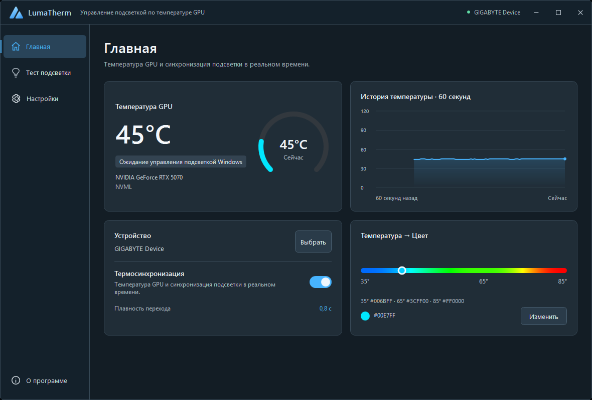
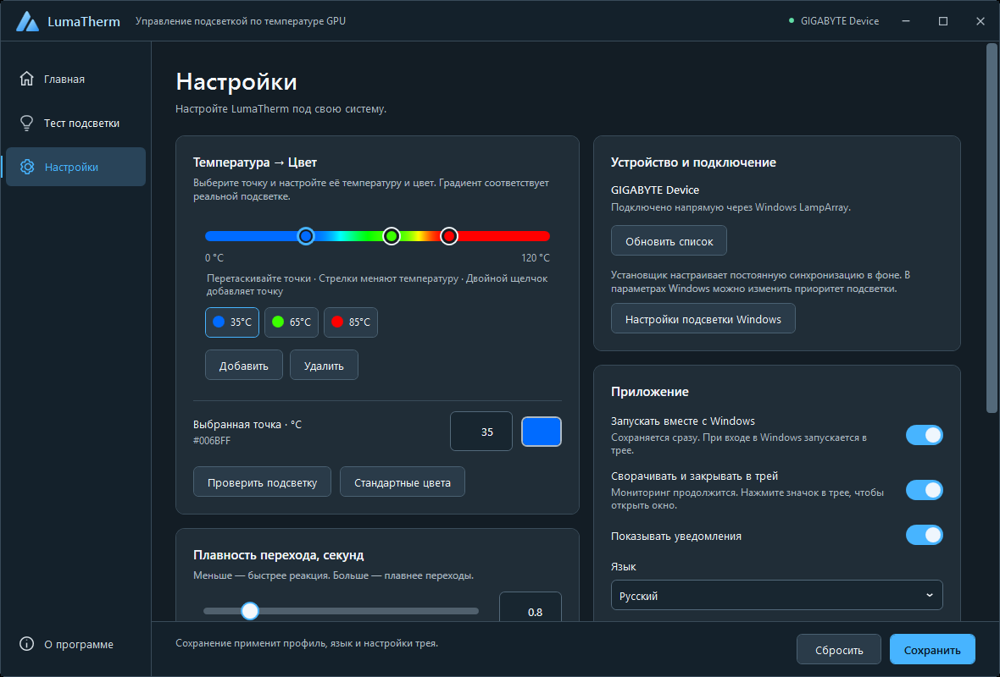
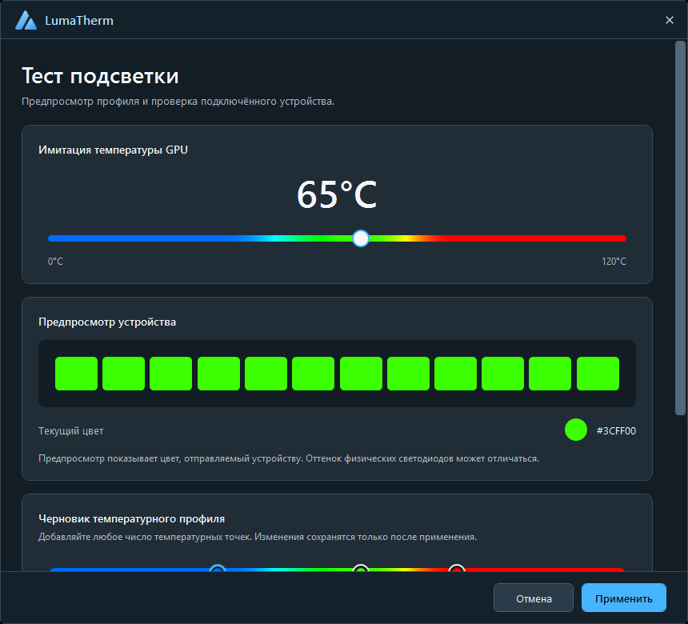
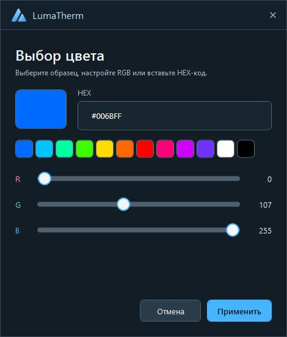
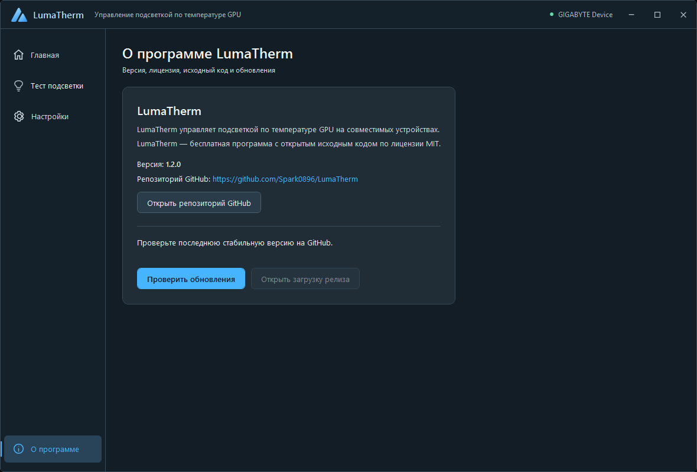

# LumaTherm

**Температура GPU → цвет подсветки.** Лёгкое приложение для Windows 11: следите за видеокартой и синхронизируйте совместимые устройства Dynamic Lighting.

[English](README.md) · Русский · [Скачать](https://github.com/Spark0896/LumaTherm/releases) · [Установка](docs/installation.ru.md)



## Температура, которую видно

Текущая температура видеокарты, история за последние 60 секунд и подсветка, которая показывает нагрев. LumaTherm сначала читает NVIDIA NVML; общая память MSI Afterburner доступна как резервный источник только для чтения. Управление подсветкой работает через Windows LampArray.

| Стандартный профиль | Температура | Цвет |
| --- | --- | --- |
| Холодный | 35°C | Синий `#006BFF` |
| Тёплый | 65°C | Зелёный `#3CFF00` |
| Горячий | 85°C | Красный `#FF0000` |

Добавляйте, перетаскивайте и удаляйте точки; выбирайте цвет через HEX, ползунки RGB или готовые образцы. Градиент на экране использует ту же плавную HSV-интерполяцию, что и подсветка. Кнопка **«Стандартные цвета»** возвращает эти три точки, сохраняя остальные настройки.

## Для повседневной работы

- Температура и название GPU, доступность устройства, состояние терморежима и история за 60 секунд.
- Тест подсветки с ползунком температуры, редактируемым профилем, текущим HEX и схематичным предпросмотром устройства. «Применить» сохраняет профиль; «Отмена» возвращает обычный режим.
- Работа в фоне через трей: открыть окно, переключить терморежим или полностью выйти из приложения.
- Необязательный автозапуск Windows, запуск свёрнутым, уведомления и выбор русского, английского или системного языка.
- Стабильные релизы проверяются только когда пользователь вручную запускает проверку, без опроса при запуске или в фоне. Обновление открывает страницу релиза и ничего не устанавливает автоматически.
- Настройки и журналы хранятся локально. Аккаунт не нужен. Исходный код доступен по [лицензии MIT](LICENSE).

## Скриншоты

Настоящие снимки текущего редизайна Arctic на русском языке. Английские снимки используются в [английском README](README.md).

| Настройки и редактор профиля | Тест подсветки |
| --- | --- |
|  |  |

| Редактор HEX и RGB | О программе и ручная проверка обновлений |
| --- | --- |
|  |  |

## Начало работы

**Версия 1.2.0:** редизайн Arctic включён в [установщик и portable-архив](https://github.com/Spark0896/LumaTherm/releases/tag/v1.2.0). Обновление сохраняет ваши настройки и пользовательский профиль.

1. Скачайте установщик и `SHA256SUMS.txt` со страницы [GitHub Releases](https://github.com/Spark0896/LumaTherm/releases). [Сверьте SHA-256](docs/installation.ru.md#проверка-sha-256).
2. Запустите установщик от имени администратора и явно разрешите импорт комплектного **публичного** сертификата. Он нужен для регистрации Windows lighting identity; закрытый ключ не импортируется.
3. Оставьте включённым **Launch LumaTherm** в конце установки. При новой установке термосинхронизация включается автоматически, совместимое устройство LampArray выбирается само.
4. Установщик автоматически включает Dynamic Lighting Windows и назначает LumaTherm приоритет управления в фоне. Кнопка **«Настройки подсветки Windows»** позволяет изменить порядок позже.
5. Сохраните работу и подтвердите предложенный перезапуск Windows, чтобы начать новый сеанс подсветки с сохранённым приоритетом.

При новой установке автозапуск включён: после входа в Windows приложение работает в трее. При обновлении сохранённые настройки сохраняются. Если Windows отключила задачу, разрешите её через кнопку **«Автозагрузка Windows»**. Когда другое приложение получает управление подсветкой, LumaTherm ожидает и возобновляет синхронизацию автоматически, без ложного предупреждения об отключении устройства.

### Требования

- Windows 11 x64, версия 22H2 или новее.
- Драйвер NVIDIA для NVML либо необязательный резервный датчик общей памяти MSI Afterburner.
- Устройство, которое Windows обнаруживает как доступное Dynamic Lighting / LampArray.

Релизные сборки самодостаточны: отдельная установка .NET Runtime или GCC не нужна. Поддержка каждого RGB-устройства не заявляется. Приложение не использует vendor DLL для подсветки или низкоуровневые HID-записи.

### Portable

Распакуйте архив в постоянную папку, проверьте хеши и выполните `./Register-LumaTherm.ps1 -ConfirmCertificateImport` в повышенном PowerShell. Регистрация явная и требует подтверждения доверия к сертификату. Не перемещайте зарегистрированную папку; подробнее — [portable](docs/portable.ru.md).

## Конфиденциальность и помощь

Настройки и журналы остаются в `%LOCALAPPDATA%/LumaTherm`. Ручная проверка обновлений обращается к [последнему релизу GitHub](https://api.github.com/repos/Spark0896/LumaTherm/releases/latest); персональные данные не отправляются. LumaTherm не исследует и не меняет программы производителей RGB.

[Устранение неполадок](docs/troubleshooting.ru.md) · [Совместимость](docs/compatibility.md) · [Проверка оборудования](docs/hardware-validation.md) · [Отчёт о редизайне](docs/qa/2026-10-03-arctic-redesign.md)

## Сборка из исходников

Нужны Windows и .NET SDK из `global.json` (**8.0.423**):

```powershell
dotnet restore LumaTherm.sln -p:NuGetAudit=false
dotnet test LumaTherm.sln -c Release -p:NuGetAudit=false
dotnet publish src/LumaTherm.App -c Release -r win-x64 --self-contained true
```

Для доступа к подсветке также нужна зарегистрированная Windows identity; см. [разработку](docs/development.md) и [portable](docs/portable.ru.md).

[Вклад в проект](CONTRIBUTING.md) · [Безопасность](SECURITY.md) · [Архитектура](docs/architecture.md) · [История изменений](CHANGELOG.md) · [Подготовка релиза](docs/releasing.md)
